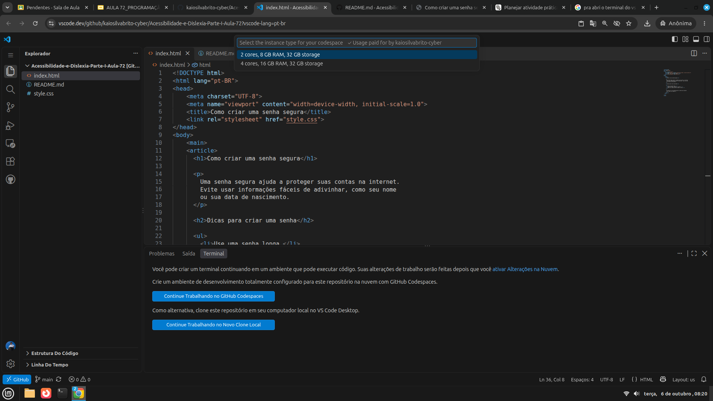

# Acessibilidade-e-Dislexia-Parte-I-Aula-72

## Sobre o projeto

Página simples de blog com dicas para criar senhas seguras, com foco em uma leitura mais clara e acessível.

## Criar a base do HTML

Digite `!` no arquivo HTML para criar a estrutura do HTML.

## Código HTML

“O que poderíamos mudar para facilitar a leitura?”

```html
<main>
  <article>
    <h1>Como criar uma senha segura</h1>

    <p>
      Uma senha segura ajuda a proteger suas contas na internet.
      Evite usar informações fáceis de adivinhar, como seu nome
      ou sua data de nascimento.
    </p>

    <h2>Dicas para criar uma senha</h2>

    <ul>
      <li>Use uma senha longa.</li>
      <li>Misture letras, números e símbolos.</li>
      <li>Não use a mesma senha em todos os sites.</li>
    </ul>

    <p>
      Se possível, use um gerenciador de senhas para guardar
      suas senhas com segurança.
    </p>
  </article>
</main>
```

## Conectar o CSS com o HTML

Na linha 07 do HTML:

```html
<link rel="stylesheet" href="style.css">
```

### Explicação resumida de todas as propriedades do código CSS:


• font-family: Arial, sans-serif; -> Define o tipo da letra (Arial ou similar).

• font-size: 18px; -> Define o tamanho da letra (18 pixels).

• line-height: 1.7; e 1.3; -> Define o espaçamento entre as linhas do texto.

• color: #222; -> Define a cor do texto (cinza-escuro).

• background-color: #f4f6f8; e white; -> Define a cor do fundo (cinza-claro ou branco).

• max-width: 680px; -> Define a largura máxima do bloco de conteúdo.

• margin: 40px auto; -> Cria espaço fora e centraliza o bloco na tela.

• padding: 24px; e 28px; -> Cria um espaço interno para o texto não colar nas bordas.

• border-radius: 8px; -> Deixa os cantos do bloco arredondados.

• margin-bottom: 18px; e 10px; -> Cria um espaço na parte de baixo para separar os parágrafos e itens.


## Código de design: `style.css`


```css
body {
  font-family: Arial, sans-serif;
  font-size: 18px;
  line-height: 1.7;
  color: #222;
  background-color: #f4f6f8;
}

main {
  max-width: 680px;
  margin: 40px auto;
  padding: 24px;
}

article {
  background-color: white;
  padding: 28px;
  border-radius: 8px;
}

h1,
h2 {
  line-height: 1.3;
}

p {
  margin-bottom: 18px;
}

li {
  margin-bottom: 10px;
}
```

## Como abrir o projeto HTML e CSS

1. Abra este repositório no GitHub Codespaces.
2. No VS Code, abra o terminal em **Terminal → New Terminal**. Clique em **Continuar trabalhando no GitHub** e selecione a configuração mais básica.



3. Depois que abrir a nova página, execute o comando:

   ```bash
   python3 -m http.server 8000
   ```

## Explicação do programa

1. Organizar com HTML: “Usei título, subtítulo, parágrafos e uma lista para separar as ideias.”

2. Escolher uma fonte legível: “Usei Arial, uma fonte sem serifa e comum nos computadores.”

3. Aumentar o tamanho do texto: “Deixei o texto com 18px para ficar mais confortável de ler.”

4. Ajustar o espaço entre linhas: “O `line-height: 1.7` evita que as linhas fiquem muito juntas.”

5. Limitar a largura: “O `max-width` evita que cada linha fique comprida demais.”

6. Comparar antes e depois: peça à turma para dizer o que ficou mais fácil de encontrar e ler.
